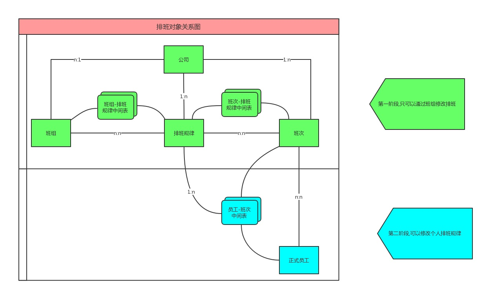
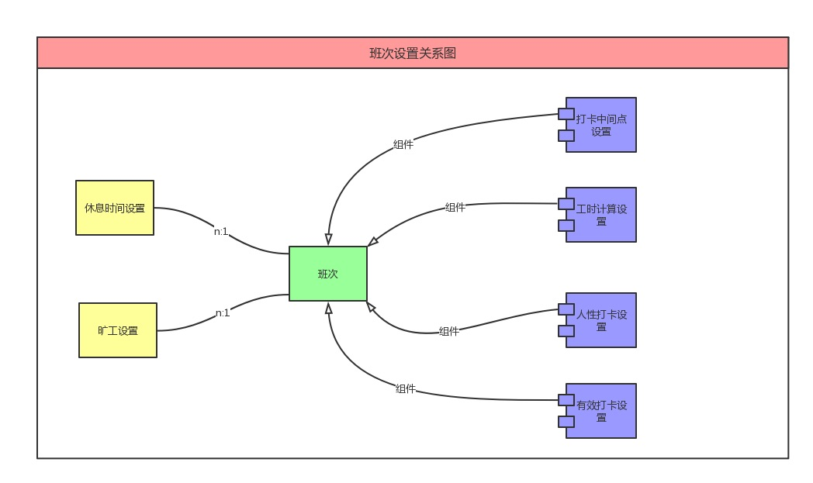
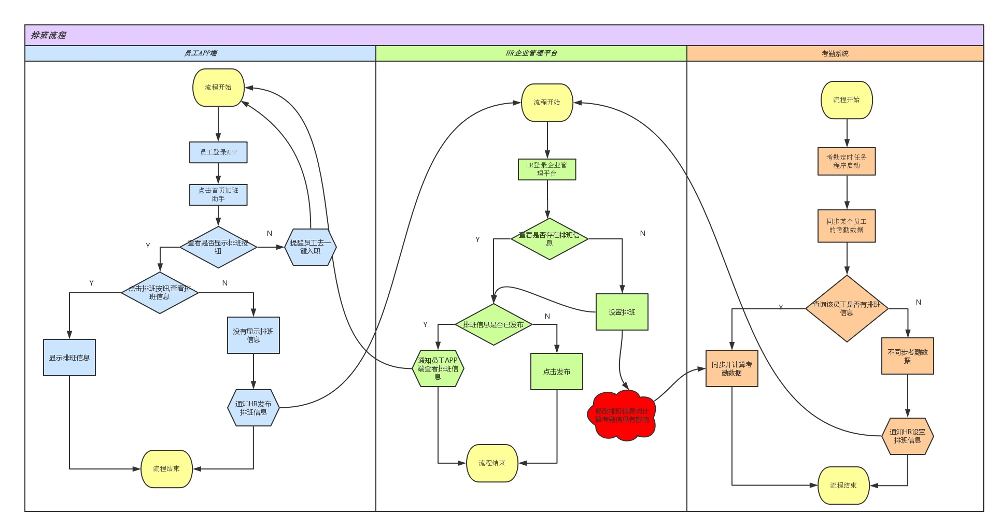

# 排班考勤功能系统设计

#### 排班对象图

###### 班次设置对象图

## 排班流程

### 权限url修改

## 首页url修改
- "/admin/employee/roster/manage/acceptOfferUsers" -> "/admin/home/employee/roster/manage/acceptOfferUsers"
- "/admin/employee/roster/manage/probation" -> "/admin/home/employee/roster/manage/probation"
- "/admin/employee/roster/manage/expiration" -> "/admin/home/employee/roster/manage/expiration"
- "/admin/user/info/detail" -> "/admin/home/user/info/detail"
- "/admin/index/schedule/view" -> "/admin/home/index/schedule/view"

## 员工入职
- 点击员工入职,页面载入时候会请求 /admin/employee/prospective/manage/list
- 页面载入时`新增url` "/admin/employee/prospective/manage/list" -> "/admin/employee/prospective/index/manage/list"
- 原"/admin/employee/prospective/manage/list"不改变

## 组织架构
- /admin/setting/department/** -> /admin/employee/structure/department/**

## 员工配置
- /admin/setting/ -> /admin/employee/setting/

## 花名册
- "/admin/employee/branCorp/list" -> "/admin/employee/roster/branCorp/list"
- "/admin/employee/setting/leave_reason/list", "/admin/employee/roster/setting/leave_reason/list"

## 班次管理
- /admin/schedule/main/index/new -> /admin/attendance/schedule/workShiftType/main/index/new
- /admin/v1/workShiftType/** -> /admin/attendance/schedule/workShiftType/**

## 排班视图
- "/admin/workShiftType/get/default", "/admin/attendance/schedule/view/workShiftType/get/default"
-  admin/employee/roster/manage/department/list -> /admin/attendance/schedule/view/department/list
- /admin/employee/roster/manage/work_shift/list -> /admin/attendance/schedule/view/work_shift/list
- "/admin/schedule/rule/views", "/admin/attendance/schedule/view/views"

## 排班规律
- /admin/schedule/rule -> /admin/attendance/schedule/rule

